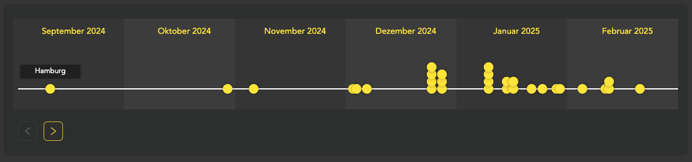

# Horizontal Timeline Component for React

I couldn't find a simple, minimalist horizontal timeline for React. The good ones are all vertical. So I made my own:




## Installation

You can install this component directly from the GitHub repository.
### Using npm:

```bash
npm install nils-nilsen/react-timeline-component
```
### Using Yarn:

```bash
yarn add your-username/react-timeline-component
```

## Usage
Here’s an example of how to use the Timeline component in your project:
```jsx
import React from 'react';
import Timeline from 'react-timeline-component';

const events = [
    { date: '2024-08-24', name: 'Event 1' },
    { date: '2024-09-12', name: 'Event 2' },
    // Add more events here
];

function App() {
    return (
        <div>
            <h1>Project Timeline</h1>
            <Timeline events={events} />
        </div>
    );
}

export default App;
```

## Probs
### Timeline Component

| Prop     | Type            | Required | Description                                                      |
|----------|-----------------|----------|------------------------------------------------------------------|
| `events` | `TimelineEvent[]`| Yes      | An array of event objects, each containing a `date` and `name`.  |


### Event Object

| Property | Type     | Required | Description                                         |
|----------|----------|----------|-----------------------------------------------------|
| `date`   | `string` | Yes      | The date of the event in `YYYY-MM-DD` format.       |
| `name`   | `string` | Yes      | The name or title of the event.                     |


## License

This project is licensed under the MIT License.

###  Libraries Used
This project makes use of the following open-source libraries:

- [React](https://react.dev): A JavaScript library for building user interfaces.
- [Ant Design](https://ant.design): A design system for enterprise-level products, which provides a set of React components.
- [@ant-design/icons](https://github.com/ant-design/ant-design-icons): A package that provides icons for Ant Design.


Please ensure you comply with the respective licenses of these libraries when using or distributing this component.